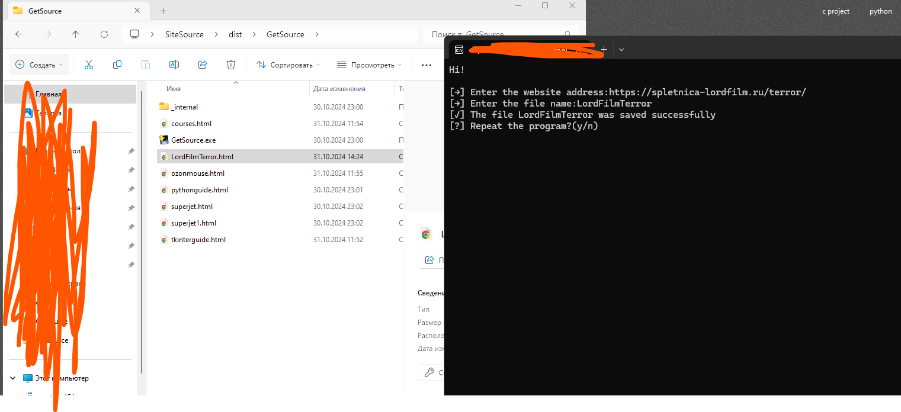

Простая программа на python, библиотека запросов, которая получает исходный html-код сайта в отдельном созданном файле               
                     
A simple python program, the requests library, which receives the source html code of the site in a separate created file       

